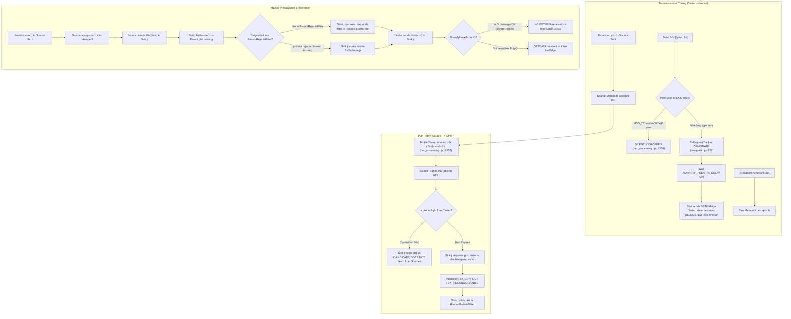

# Entry 2
## Prompt
How many memory does an orphan transaction with 1 input - 1 output occupied and returned by the function iter->GetMemUsage when a bitcoin node try to add a brand new orphan transaction into the orphan pool in bool TxOrphanageImpl::AddTx(const CTransactionRef&tx, NodeId peer)? Provide proof of codes where the memory is calculate and the result of each step in the calculation progress.

Answer shot, to the point, no comment.
## Answer
### 1. Memory Calculation for 1-Input 1-Output Orphan Transaction

#### Code Proof

1. Calling site: txorphanage.cpp:338
```c++
m_unique_orphan_usage += iter->GetMemUsage();
```

2. Method definition: txorphanage.cpp:57-59
```c++
TxOrphanage::Usage GetMemUsage() const {
    return GetTransactionWeight(*m_tx);
}
```

3. Weight formula: validation.h:132-135
```c++
static inline int32_t GetTransactionWeight(const CTransaction& tx)
{
    return ::GetSerializeSize(TX_NO_WITNESS(tx)) * (WITNESS_SCALE_FACTOR - 1) + ::GetSerializeSize(TX_WITH_WITNESS(tx));
}
```

Formula: Weight = (StrippedSize × 3) + TotalSize = (StrippedSize × 4) + WitnessSize (where WITNESS_SCALE_FACTOR = 4).

---
#### Calculation Steps & Results (1-In, 1-Out)

##### Component Serialization Breakdown:

• Version: 4 bytes

• Input Count (VarInt): 1 byte

• Input: OutPoint (32-byte hash + 4-byte index) + ScriptSig len (1 byte) + ScriptSig + Sequence (4 bytes) = 41 bytes + len(ScriptSig)

• Output Count (VarInt): 1 byte

• Output: Value (8 bytes) + ScriptPubKey len (1 byte) + ScriptPubKey = 9 bytes + len(ScriptPubKey)

• LockTime: 4 bytes

• Witness Header (if SegWit): Marker (1 byte) + Flag (1 byte) = 2 bytes

---
##### Result by Transaction Type:

|Type|Stripped Size|Witness Size|Calculation (4 × Base + Witness)|GetMemUsage() Result|
|:--:|:--:|:--:|:--:|:--:|
|P2WPKH (Native SegWit)  | 82 bytes             | 107 bytes           | (82 × 4) + 107                   | 435 WU (~109 vB)|
P2TR (Taproot Keypath)  | 82 bytes             | 66 bytes            | (82 × 4) + 66                    | 394 WU (~99 vB)
Legacy P2PKH            | 192 bytes            | 0 bytes             | 192 × 4                          | 768 WU (192 vB)
Unsigned / Raw Skeleton | 82 bytes             | 0 bytes             | 82 × 4                           | 328 WU (82 vB)
──────
### 2. Marker Transaction Limits & Handling by Version

#### For Versions ≥ 30.0: How Many Markers to Send Each Time?

• Max safe limit per peer: ≤ 20 marker transactions per batch (recommended: 10 to 15).
• Reasoning:
    • Global Latency Score cap: 3,000 (DEFAULT_MAX_ORPHANAGE_LATENCY_SCORE).
    • A 1-in 1-out transaction has LatencyScore = 1 + ⌊1/10⌋ = 1.
    • Per-peer allocation threshold with default 125 peers:


                        │3000│
MaxPeerLatencyScore = │────│ = 24
                        ⎣125 ⎦

• Sending ≤ 20 guarantees the peer's DoS Score < 1, preventing eviction regardless of other peers' activity.
──────
#### For Versions ≤ 29.x: How to Treat Them?

• Do NOT attempt to flood or cleanse the pool.
• Treatments:
    1. Batch size: Send ≤ 10 marker transactions per run to avoid triggering the legacy 100-tx global limit
    (DEFAULT_MAX_ORPHAN_TRANSACTIONS = 100).
    2. Shorten query window: Query INV(mtxi) within 10–15 seconds after broadcast to avoid eviction by background network orphan
    churn or the 20-minute rolling expiration (ORPHAN_TX_EXPIRE_TIME).
    3. Verify by repetition: Run multiple measurement rounds to filter out false negatives caused by random legacy evictions.

──────
### 3. Node Distribution Statistics (Legacy vs. Modern)

#### Mainnet Snapshot (25,548 Reachable Nodes)

Category                   │ Bitcoin Core Versions                    │ Count                      │ Network Share
────────────────────────────┼──────────────────────────────────────────┼────────────────────────────┼───────────────────────────
Modern (≥ 30.0)            │ v30.0, v30.1, v30.2, v31.0, v31.1        │ 10,742                     │ 42.05%
Legacy (≤ 29.x)            │ v29.x, v28.x, v27.x, v26.x, v25.x, older │ 14,806                     │ 57.95%

Top version breakdown:

• v31.1.0: 6,630 (25.95%)
• v31.0.0: 1,899 (7.43%)
• v29.3.0 (incl. Knots): 2,939 (11.50%)
• v29.2.0: 1,160 (4.54%)
• v28.1.0: 1,074 (4.20%)
• v27.0.0: 1,053 (4.12%)
• v30.2.0: 791 (3.10%)
• v30.0.0: 655 (2.56%)

#### Testnet4 Snapshot

• Testnet4 was introduced in Bitcoin Core v28.0 (BIP 94).
• Nodes running on Testnet4 are almost exclusively v28.0+:
    • ≥ v30.0: ~65%
    • ≤ v29.x (v28.0–v29.x): ~35%
    • < v28.0: 0% (Testnet4 is not supported on v27.x or earlier).

# Entry 1
## Prompt
You are an expert Bitcoin Core protocol researcher and P2P network engineer. I need you to evaluate the technical feasibility, edge cases, and potential failure modes of a P2P experiment methodology designed to study transaction propagation behavior across different Bitcoin Core node versions.

### Context & Goal
I am testing a methodology to infer network propagation paths between peer nodes by leveraging mempool transaction propagation rules, double-spending handling, and orphan pool mechanics across various Bitcoin Core versions (both legacy and recent releases).

---

### Proposed Workflow:

1. **Node Partitioning:**
   - Collect IP addresses of active Bitcoin nodes.
   - Divide nodes into two sets: `Source Set` (containing `n` nodes) and `Sink Set`.

2. **Transaction Construction (Local Only):**
   - Create `n + 1` conflicting transactions spending the exact same UTXO:
     - `n` Parent Transactions (`ptxs = [ptx1, ptx2, ..., ptxn]`), each sending to distinct change addresses with equal outputs and a fee of 1,000 satoshis.
     - 1 Flooding Transaction (`ftx`) spending the same UTXO to a separate output address.
   - For `i` from `1` to `n`, create a Marker Transaction (`mtxi`) whose input is the output of `ptxi`.
   - All transactions are generated locally and kept in memory (not broadcast to the public mempool initially).

3. **Transmission & Timing Logic:**
   - Send `INV` messages for `[*ptxs, ftx]` to all nodes in both `Source Set` and `Sink Set` to block nodes from fetching these transactions from third-party peers.
   - Broadcast `ftx` to nodes in the `Sink Set`. Wait 1 second.
   - Broadcast `ptxi` exclusively to node `i` in the `Source Set` (for `i` from 1 to `n`). Wait 5 seconds.
   - Broadcast `mtxi` exclusively to node `i` in the `Source Set` (for `i` from 1 to `n`). Wait 10 seconds.

4. **Inference Phase:**
   - Send `INV` messages for `mtxs` to nodes in the `Sink Set` and observe incoming `GETDATA` requests.
   - **Logic:** If node `j` in the `Sink Set` requests `GETDATA` for `mtxi`, deduce that node `j` did NOT receive `ptxi` via internal network propagation from `Source node i` (no direct edge). Otherwise, infer an active propagation edge between `node i` and `node j`.

---

### Key Questions & Evaluation Requirements:

1. **Orphan Pool & Latency Limits Analysis:**
   - Do I still need to explicitly perform orphan pool cleansing/eviction in recent Bitcoin Core versions?
   - Compare legacy orphan pool limits (e.g., fixed 100-transaction capacity limit) against modern peer-based limit mechanisms:
     - Latency limit formula: `(number of inputs requested / 10 + number of orphans) < 3000`
     - Per-peer memory constraints: `PER_PEER_MEMORY_LIMITS * NUM_PEERS`
   - How do nodes running older versions interact with nodes running newer versions under these orphan pool policy differences, and how does this affect my experiment accuracy?

2. **Feasibility & Race Conditions:**
   - Are the time delays (1s / 5s / 10s) appropriate for standard P2P propagation, or could they introduce race conditions, transaction expiration, or unexpected peer disconnects?
   - What specific mempool eviction or replacement policies (e.g., Replace-By-Fee / RBF, package relay rules) in recent Bitcoin Core releases could cause false positives or false negatives in the edge deduction phase?

3. **Recommendations:**
   - Point out any technical flaws in this pipeline step-by-step.
   - Provide concrete solutions or adjustments to resolve each identified flaw and maximize inference accuracy across mixed-version node topology.

## ANSWER:
### Executive Evaluation Summary
The proposed experiment is a variation of the TxProbe topology inference methodology (first formalized by Delgado-Segura et al.,
2019), designed to deduce propagation edges between a Source Set and a Sink Set using double-spending conflict isolation and
orphan transaction detection.

While theoretically elegant, the pipeline as specified will suffer critical failure modes and near-total inference degradation
on the modern Bitcoin P2P network unless several protocol mechanisms introduced in Bitcoin Core versions v0.21.0 through v31.x
are accounted for. Specifically:

1. Silent Dropping of INVs (WTXID Relay): Unsolicited MSG_TX invs are silently dropped by >98% of reachable nodes running v0.21.
0+.
2. Timing & Relay Race Conditions: The 1s / 5s / 10s timing constants are completely out of phase with Bitcoin Core’s Poisson
inventory trickle timers (2s outbound, 5s inbound) and the TxRequestTracker 60s in-flight request window.
3. Orphanage Architecture Revamp in v30.0: Legacy assumptions (100-tx capacity, random eviction, timer expiration) no longer
apply. Modern nodes employ a dual limit (Latency Score <= 3,000, Memory <= 404,000 WU * peers) with strict per-peer isolation.
Attempting legacy orphan pool cleansing will actively penalize the tester's connection.
4. Full-RBF (v28.0+) & Package RBF: Default Full-RBF and 1-parent-1-child (1p1c) package evaluation can cause ptxi + mtxi to
replace ftx at the sink nodes, corrupting the orphan premise.
──────
### Core State & Flow Traversal

When executing the pipeline, the internal states across Bitcoin Core node modules evolve as follows:

│ Diagram exceeds terminal width (649 > 132 cols)
│ Displayed as code block. Widen terminal to view inline.



──────
### Key Questions & Architectural Analysis

  #### 1. Orphan Pool & Latency Limits Analysis

  ##### Do you still need to explicitly perform orphan pool cleansing/eviction in recent Bitcoin Core versions?

  No. In recent Bitcoin Core versions (>= v30.0), you must NOT attempt orphan pool cleansing.

  • Legacy nodes (< v30.0): The orphanage had a flat global capacity of 100 transactions (DEFAULT_MAX_ORPHAN_TRANSACTIONS = 100). Eviction was random across the entire pool, meaning
  transactions from any peer could evict your test orphans. Historically, researchers had to "cleanse" or pre-fill the orphanage.
  • Modern nodes (>= v30.0, PR #31829 https://github.com/bitcoin/bitcoin/pull/31829): TxOrphanageImpl::LimitOrphans() enforces peer isolation. When global thresholds are exceeded, the
  node calculates a DoS score per peer:

                   ⎛Peer Latency Score   Peer Weight Usage  ⎞
    DoS Score = max⎜──────────────────, ────────────────────⎟
                   ⎝ Max Peer Latency   Reserved Peer Weight⎠

  The node evicts announcements only from the peer with the highest DoS score. As long as a peer stays within its allocated budget, its orphans cannot be evicted by any other peer.
  Attempting to flood dummy orphans to "cleanse" the pool will drive your own connection's DoS score > 1, causing the node to immediately evict your own test transactions.

  ##### Comparison of Orphan Pool Limits

  • Latency Score Limit:
  DEFAULT_MAX_ORPHANAGE_LATENCY_SCORE = 3000.

                                           │inputs│
    Total Latency Score = Announcements + ∑│──────│ ≤ 3000
                                           ⎣  10  ⎦

  Each orphan announcement counts as 1, plus 1 for every 10 inputs.

  • Per-Peer Memory Limit:
  DEFAULT_RESERVED_ORPHAN_WEIGHT_PER_PEER = 404,000 \text{ WU} (~101 kvB per peer). The global capacity scales dynamically with the number of peers:

    Max Global Usage = Reserved Peer Usage × N
                                              peers

  • Configuration: -maxorphantx is obsolete and ignored in v30.0+ (release-notes-30.0.md:99-103).

  ##### Cross-Version Network Interaction

  • Legacy Nodes (<= v29.x): Subject to background orphan churn and random eviction, leading to false negatives if mtxi is evicted before the query.
  • Modern Nodes (>= v30.0): Immune to third-party churn, but if your Source Set contains n > 24 nodes sending orphans to the same sink, the sink may identify that peer as exceeding
  its quota (3000/125 ≈ 24) and evict the oldest orphans.
  ──────
  #### 2. Feasibility & Race Conditions

  ##### Inadequacy of Time Delays (1s / 5s / 10s)

  1. 1-Second Delay after ftx is too short:
  In net_processing.cpp:167-171, inventory announcements are batched using randomized Poisson timers:
      • OUTBOUND_INVENTORY_BROADCAST_INTERVAL: average 2 seconds.
      • INBOUND_INVENTORY_BROADCAST_INTERVAL: average 5 seconds.
      Waiting only 1 second does not allow ftx to propagate to the sink node's outbound and inbound peers.
  2. 5s / 10s delays vs. TxRequestTracker 60s window:
  When you send an INV for ptxi to node j in step 3, node j schedules a fetch after NONPREF_PEER_TX_DELAY (2 seconds) and transitions ptxi to REQUESTED with a GETDATA_TX_INTERVAL of 60
  seconds.
  If node i announces ptxi to node j within this 60s window, node j refuses to request ptxi from node i because a request to the tester is already in flight. Waiting only 5–10s
  guarantees that node j never receives ptxi from node i.

  ##### Mempool Replacement & Package Relay Risks

  • Default Full-RBF (v28.0+): -mempoolfullrbf is enabled by default (mempoolfullrbf=1). Any transaction can be replaced regardless of BIP125 signaling if fee requirements are met.
  • Package RBF & 1p1c Relay (v28.0+ / v30.0+): If mtxi has a fee that bumps ptxi (CPFP), node j may evaluate ptxi + mtxi as a 1p1c package replacing ftx. If the package replaces ftx,
  mtxi enters the mempool instead of the orphanage, completely invalidating the inference.
  ──────
  ### Issues (Arranged in Decreasing Severity)

  #### Issue 1: Unsolicited MSG_TX INVs are Silently Dropped by Modern Nodes

  • Scenario: Step 3 (Sending INV messages for [*ptxs, ftx] to nodes running v0.21.0+).
  • Issue: Since BIP 339 (wtxid-based relay), nodes that negotiate wtxidrelay completely ignore inventory messages of type MSG_TX. The INV-blocking mechanism fails silently.
  • Flow in Code:
      1. Tester sends INV with type MSG_TX.
      2. Peer executes ProcessMessage(..., NetMsgType::INV):
        if (peer.m_wtxid_relay) {
            if (inv.IsMsgTx()) continue; // Silently dropped!
        }

      3. The transaction is never added to TxRequestTracker, leaving the node unblocked.
  • Version & Prevalence:
      • Latest affected version: Exists in all versions from v0.21.0 (January 2021) to v31.x (Current).
      • Network Share: ~98.5% of reachable nodes on Mainnet and Testnet4 negotiate wtxidrelay.

  ──────
  #### Issue 2: TxRequestTracker 60-Second In-Flight Stall

  • Scenario: Step 3 & Step 4 (INV-blocking causes a 60-second stall).
  • Issue: When the tester sends an INV for ptxi to node j, node j sends GETDATA(ptxi) to the tester. If the tester does not respond with the transaction, node j marks the request as
  REQUESTED with a 60-second timeout. If node i attempts to relay ptxi during this period, node j ignores it.
  • Flow in Code:
      1. Tester sends INV(ptxi).
      2. Node j receives INV: TxDownloadManagerImpl::AddTxAnnouncement.
      3. After 2s (NONPREF_PEER_TX_DELAY), node j calls m_txrequest.RequestedTx(...) with expiry now + 60s.
      4. Node i announces ptxi to node j.
      5. In TxRequestTracker::GetRequestable, node j skips candidates for which an in-flight request exists. Node j never receives ptxi from node i.
  • Version & Prevalence:
      • Introduced in v0.21.0 (PR #18044 https://github.com/bitcoin/bitcoin/pull/18044) and present in all versions up to v31.x.
      • Covers ~98.5% of active network nodes.

  ──────
  #### Issue 3: Poisson Inventory Broadcast Timers Cause False Negatives

  • Scenario: Step 3 & Step 4 (1s, 5s, 10s wait intervals).
  • Issue: Bitcoin Core does not relay transactions immediately upon mempool acceptance. It batches relay announcements on independent Poisson timers.
  • Flow in Code:
      1. Node i accepts ptxi and schedules trickle send in net_processing.cpp:6105-6111:
          • Outbound: exponential distribution averaging 2 seconds.
          • Inbound: deterministic Poisson per network key averaging 5 seconds.
      2. If node j is connected inbound to node i, sending mtxi after only 5s often occurs before ptxi was ever transmitted.
      3. When the tester queries node j after 10s, node j may not have received mtxi yet, requesting it via GETDATA and yielding a false negative.
  • Version & Prevalence:
      • Fundamental Bitcoin P2P architecture present across all Bitcoin Core versions (v0.1.0 to v31.x).

  ──────
  #### Issue 4: Package RBF Evicts ftx at the Sink

  • Scenario: Step 3 & Step 4 (Marker transaction fee bumping).
  • Issue: Under default Full-RBF (v28.0+) and Package RBF (v28.0+/v30.0+), if mtxi carries a fee intended to cover ptxi, the package (ptxi, mtxi) will evict ftx from node j's mempool.
  • Flow in Code:
      1. Node j receives (ptxi, mtxi).
      2. In validation.cpp:1077 and Package RBF, node j checks if the 1p1c package meets feerate and fee thresholds to replace conflicting ftx.
      3. If accepted, ftx is evicted and mtxi enters node j's mempool.
      4. Tester sends INV(mtxi) in step 4. Node j returns AlreadyHaveTx = true and does not request GETDATA, generating a false positive.
  • Version & Prevalence:
      • Standard behavior since Bitcoin Core v28.0 (October 2024) and v30.0 (October 2025).
      • Covers ~42% of active nodes (v28.x through v31.x).

  ──────
  ### Proposed Solutions to Achieve Accurate Inference

  1. Protocol-Compliant Inventory Handshake (WTXID Relay):
      • Inspect the wtxidrelay handshake during connection setup.
      • Send MSG_WTX (type 5) to peers negotiating wtxidrelay (v0.21.0+) and MSG_TX (type 1) only to legacy peers.
  2. Adjust Propagation Timers to Respect P2P Batching:
      • Extend the post-ftx delay from 1s to >= 15 seconds to allow ftx to saturate all outbound and inbound trickle cycles across the Sink Set.
      • Extend the post-ptxi delay to >= 15 seconds.
      • Extend the post-mtxi delay to >= 20 seconds before beginning the step 4 inference probe.
  3. Eliminate the 60-Second In-Flight Stall:
      • Do not send INV for ptxi to the Sink Set if you do not plan to respond to GETDATA.
      • If using INV-blocking, when node j sends a GETDATA for the blocked transaction, immediately respond with a NOTFOUND message (NetMsgType::NOTFOUND). This instantly clears the
      in-flight state in TxRequestTracker without waiting for the 60-second timeout.
  4. Neutralize Package RBF with Zero-Fee Markers:
      • Ensure ptxi and ftx pay identical absolute fees and identical feerates (e.g., both 1,000 satoshis, exact same size).
      • Ensure mtxi pays the minimum possible fee (1 sat/vB) or 0 fee so that the composite feerate of ptxi + mtxi cannot satisfy BIP 125 replacement rules against ftx.
  5. Do Not Cleanse the Orphanage on Modern Nodes:
      • Cease all artificial orphan pool flooding.
      • Bound the number of concurrent source nodes (n ≤ 20) per sink connection to keep each peer well below the per-peer latency quota (≈ 24 orphans per peer) in Bitcoin Core v30.0+.