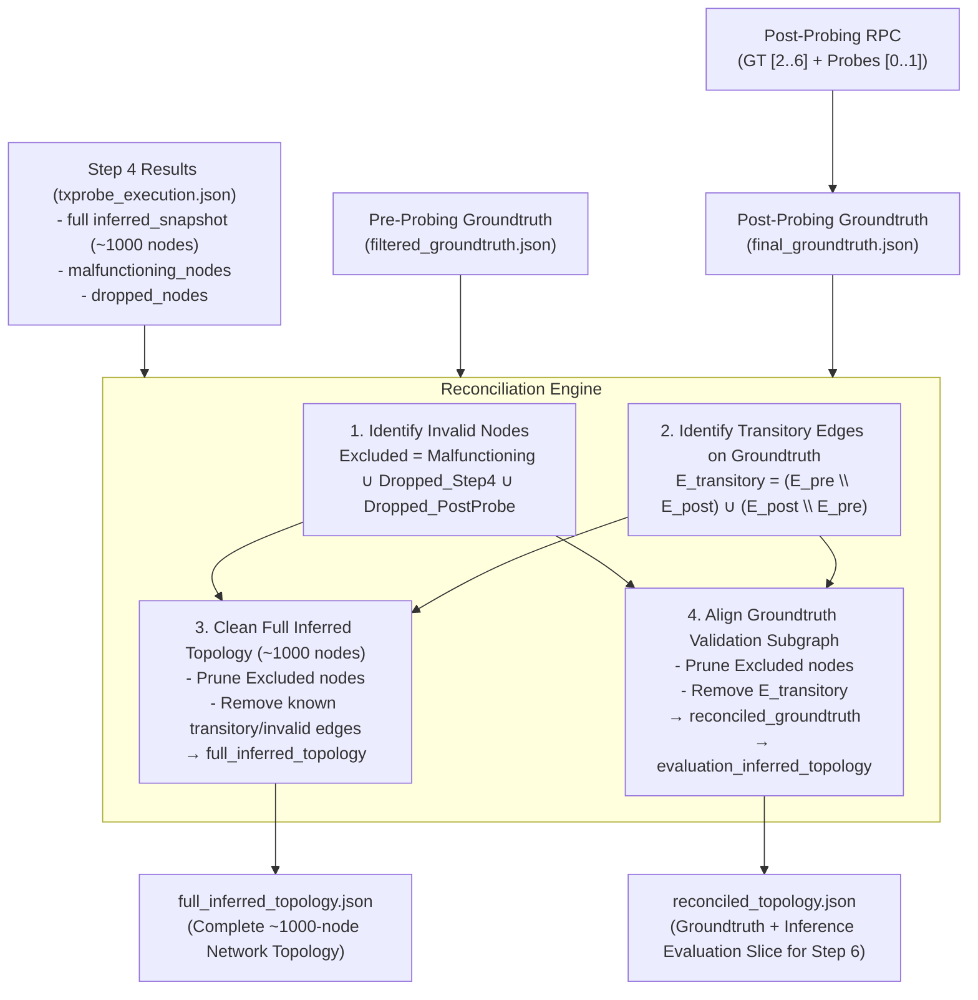

# Step 5 Plan: Malfunction Filtering, Post-Probing Groundtruth Reconciliation & Full Inference Topology

**Date**: 2026-10-01 19:35  
**Status**: Proposal & Review Pending User Confirmation  
**Target Milestone**: Step 5 of TxProbe Pipeline

---

## 1. Goal of Step 5

TxProbe is designed to infer the **entire network topology** across all ~1000 discovered nodes in the Bitcoin Testnet4 network, while using Groundtruth nodes [2..6] as a localized reference to evaluate inference precision, recall, and accuracy.

During multi-round probing in Step 4 (executing over several minutes across ~1000 nodes), churn and malfunctions can affect both the full network and the groundtruth reference:
1. **Malfunctioning Sources**: Nodes flagged in Step 4 (`malfunctioning_nodes`) due to invalid orphan resolution or premature mempool leaks.
2. **Disconnected / Dropped Nodes**: Nodes that disconnected from Probe 0 or Probe 1 during Step 4 (`dropped_nodes`) or post-probing.
3. **Transitory Edges**: P2P connections on groundtruth nodes [2..6] that established or broke mid-experiment ($E_{\text{transitory}}$).

The goal of **Step 5** is to:
1. **Clean the Full Network Inference Topology**:
   - Eliminate all invalid nodes (malfunctioning nodes + mid-run/post-probing disconnected nodes) from the **entire inferred graph** of ~1000 nodes.
   - Eliminate all known invalid/transitory edges from the full inferred graph.
   - Export the verified **Full Inferred Network Topology** (`full_inferred_topology.json`), representing the final inferred Bitcoin Testnet4 network structure across all surviving public and probe-connected nodes.
2. **Reconcile Groundtruth for Step 6 Validation**:
   - Capture post-probing groundtruth from Nodes [2..6] and Probes [0, 1].
   - Filter transitory edges and invalid nodes symmetrically to produce `reconciled_groundtruth.json` and the corresponding evaluation slice `evaluation_inferred_topology.json`.

---

## 2. Main Needed Changes

1. **Enhance `GraphSnapshot` in `txprobe/txprobe/models/graph.py`**:
   - Add `remove_edges(edges_to_remove: Iterable[tuple[NodeIdentity, NodeIdentity]]) -> GraphSnapshot` to support immutable edge deletion on any graph.

2. **New Module `txprobe/txprobe/reconciliation.py`**:
   - **Data structures**:
     - `ReconciliationStats`:
       - `initial_full_nodes`: Total nodes entering Step 5 (~1000).
       - `surviving_full_nodes`: Surviving nodes in full topology.
       - `full_inferred_edges_count`: Edge count in the full network topology.
       - `malfunctioning_nodes_count`: Count of malfunctioning nodes removed.
       - `dropped_nodes_count`: Count of dropped/disconnected nodes removed.
       - `transitory_edges_count`: Count of transitory edges detected & eliminated.
       - `groundtruth_eval_nodes_count`: Node count in evaluation sub-topology.
       - `groundtruth_eval_edges_count`: Stable groundtruth edges count.
     - `ReconciliationResult`:
       - `full_inferred_topology: GraphSnapshot` (The complete ~1000-node inferred network graph).
       - `reconciled_groundtruth: GraphSnapshot` (Stable groundtruth reference).
       - `evaluation_inferred_topology: GraphSnapshot` (Inference slice aligned with groundtruth nodes for Step 6 metrics).
       - `surviving_nodes: tuple[NodeIdentity, ...]`
       - `malfunctioning_nodes_removed: tuple[NodeIdentity, ...]`
       - `dropped_nodes_removed: tuple[NodeIdentity, ...]`
       - `transitory_edges_removed: tuple[tuple[str, str], ...]`
       - `stats: ReconciliationStats`
   - **Core functions**:
     - `capture_final_groundtruth`: Direct JSON-RPC querying `getpeerinfo` on Groundtruth nodes [2..6] and Probe nodes [0, 1].
     - `identify_transitory_edges`: Intersects pre- and post-probing groundtruth to find connections that formed or broke mid-run ($E_{\text{transitory}} = (E_{\text{pre}} \setminus E_{\text{post}}) \cup (E_{\text{post}} \setminus E_{\text{pre}})$).
     - `identify_invalid_nodes`: Aggregates Step 4 malfunctioning sources, Step 4 mid-probing drops, and post-probing disconnects from Probe 0 and Probe 1.
     - `build_full_inferred_topology`: Prunes invalid nodes and eliminates invalid/transitory edges from the full ~1000-node graph.
     - `reconcile_topology`: Orchestrates full topology cleanup and groundtruth evaluation alignment.

3. **New CLI Script `txprobe/scripts/reconcile_groundtruth.py`**:
   - Flags:
     - `--config`: Config file path.
     - `--step4-results`: Path to `txprobe_execution.json`.
     - `--filtered-groundtruth`: Path to Step 2 `filtered_groundtruth.json`.
     - `--final-groundtruth`: Optional path to pre-captured final groundtruth (for replay/offline mode).
     - `--output`: Output path for `reconciled_topology.json`.
     - `--output-full-graph`: Output path for standalone `full_inferred_topology.json`.

4. **Unit Tests in `txprobe/tests/test_reconciliation.py`**:
   - Validates that malfunctioning nodes, dropped nodes, and transitory edges are eliminated from **both** the full inferred topology and the groundtruth evaluation graph.

---

## 3. Detailed Pipeline of Step 5

### 3.1 Capturing Post-Probing State
- Query `getnetworkinfo` + `getpeerinfo` on Groundtruth nodes [2..6] and `getpeerinfo` on Probe nodes [0, 1].
- Extract active full-relay connections.

### 3.2 Identifying Invalid Nodes & Edges
- **Invalid Nodes**:
  - `malfunctioning_nodes`: Sources requesting parent or marker transactions during Step 4.
  - `dropped_nodes`: Nodes that dropped during Step 4 execution or are no longer connected to Probe 0 or Probe 1.
- **Invalid / Transitory Edges**:
  - Edges incident to Groundtruth nodes that dropped mid-probing ($E_{\text{pre}} \setminus E_{\text{post}}$) or newly established mid-probing ($E_{\text{post}} \setminus E_{\text{pre}}$).

### 3.3 Cleaning the Full Inferred Topology (~1000 nodes)
- Remove all invalid nodes:
  $$V_{\text{surviving\_full}} = V_{\text{full}} \setminus (\text{Malfunctioning} \cup \text{Dropped})$$
  `full_inferred_topology = inferred_snapshot.prune_nodes(V_surviving_full)`
- Remove any known invalid/transitory edges:
  `full_inferred_topology = full_inferred_topology.remove_edges(transitory_edges)`
- This produces the clean, final **Full Inferred Network Topology** over all valid nodes in the network.

### 3.4 Reconciling Groundtruth & Evaluation Slice
- Prune `filtered_groundtruth` to $V_{\text{surviving\_full}}$ and remove $E_{\text{transitory}}$:
  `reconciled_groundtruth = groundtruth.remove_edges(transitory_edges).prune_nodes(V_surviving_full)`
- Extract the corresponding groundtruth evaluation slice from inference:
  `evaluation_inferred_topology = full_inferred_topology.prune_nodes(reconciled_groundtruth.nodes)`
- This ensures Step 6 evaluates metrics strictly on the common, stable groundtruth sub-universe while preserving the complete inferred network graph for topology analysis (degree distribution, clustering, graph density).

---

## 4. Evaluation & Edge Cases

- **Full Graph Integrity**: Pruning nodes with `GraphSnapshot.prune_nodes` guarantees symmetry: if $u$ is removed, $(u, v)$ is automatically removed from $v$'s adjacency list as well.
- **Transitory Edges in Full Inference**: By calling `remove_edges(transitory_edges)` on `full_inferred_topology`, we ensure churned groundtruth edges are purged from the global inference graph as well.
- **Dual Output**: Outputs both `full_inferred_topology.json` (the primary scientific artifact) and `reconciled_topology.json` (the evaluation baseline for Step 6 metrics).
- **Graceful Churn Handling**: If high network churn drops many public nodes, the surviving core is cleanly isolated without index or null-pointer errors.
