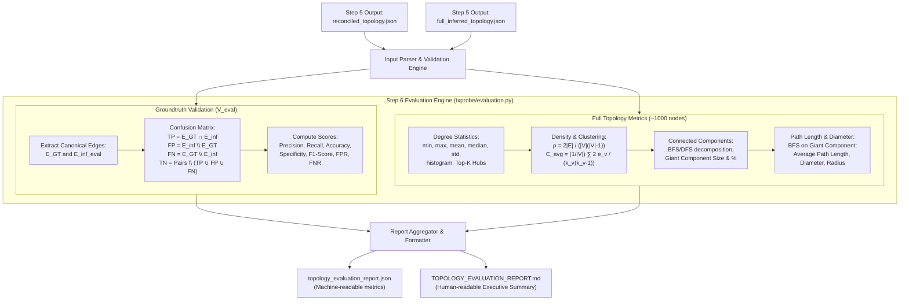

# Step 6 Plan: Metric Calculation & Topology Evaluation

**Date**: 2026-10-02 08:00  
**Status**: Proposal & Review Pending User Confirmation  
**Target Milestone**: Step 6 of TxProbe Pipeline

---

## 1. Goal of Step 6

Following Step 5, we have:
1. **Reconciled Groundtruth & Evaluation Slice** (`reconciled_topology.json`): Cleaned of transitory churn and malfunctioning nodes, providing a sound baseline $G_{GT} = (V_{\text{eval}}, E_{GT})$ and $G_{\text{inf, eval}} = (V_{\text{eval}}, E_{\text{inf, eval}})$.
2. **Full Inferred Network Topology** (`full_inferred_topology.json`): The inferred network structure across all ~1000 surviving public peers and groundtruth nodes in Bitcoin Testnet4.

The goals of **Step 6** are:
1. **Groundtruth Validation Metrics (Accuracy & Quality)**:
   - Compute the complete confusion matrix: True Positives ($\text{TP}$), False Positives ($\text{FP}$), True Negatives ($\text{TN}$), and False Negatives ($\text{FN}$) over all $\binom{|V_{\text{eval}}|}{2}$ candidate undirected pairs.
   - Compute standard binary classification metrics: Precision, Recall (Sensitivity), Accuracy, Specificity, F1-Score, False Positive Rate ($\text{FPR}$), and False Negative Rate ($\text{FNR}$).
   - Compare degree distribution and neighbor overlap on the groundtruth slice.
2. **Global Network Topology Metrics (Full Testnet4 Graph Analysis)**:
   - **Scale & Degree Distribution**: Total nodes $|V|$, total edges $|E|$, minimum, maximum, mean, median, and standard deviation of node degrees.
   - **Degree Histogram**: Binned degree distribution to characterize the degree distribution (power-law vs random / scale-free).
   - **Hub / Supernode Detection**: Identify top-$k$ highest-degree nodes (critical network routing hubs / public services / mining pools).
   - **Graph Density**: Ratio of actual edges to possible edges: $\rho = \frac{2|E|}{|V|(|V|-1)}$.
   - **Clustering Coefficient**: Local clustering coefficient $C(v)$ and network average clustering coefficient $\bar{C}$, compared against an equivalent Erdős–Rényi random graph $G(n, p)$.
   - **Connected Components & Reachability**: Number of connected components, size and fraction of the Giant Connected Component (GCC), and isolated nodes count.
   - **Shortest Path Length & Diameter**: Average shortest path length, diameter (maximum eccentricity), and radius (minimum eccentricity) within the Giant Connected Component.
3. **Automated Reporting & CLI**:
   - Save structured JSON report: `topology_evaluation_report.json`.
   - Generate an executive human-readable Markdown report: `TOPOLOGY_EVALUATION_REPORT.md`.
   - Provide CLI script: `txprobe/scripts/evaluate_topology.py` supporting both unified `reconciled_topology.json` input and standalone graph JSONs.

---

## 2. Main Needed Changes

### 2.1 New Module `txprobe/txprobe/evaluation.py`
Data structures & models:
- `ConfusionMatrix`:
  - `tp: int`, `fp: int`, `tn: int`, `fn: int`
- `ValidationMetrics`:
  - `confusion_matrix: ConfusionMatrix`
  - `precision: float`, `recall: float`, `accuracy: float`, `specificity: float`, `f1_score: float`
  - `fpr: float`, `fnr: float`
  - `gt_edges_count: int`, `inferred_edges_count: int`, `total_candidate_pairs: int`
  - `tp_edges: tuple[tuple[str, str], ...]`, `fp_edges: tuple[tuple[str, str], ...]`, `fn_edges: tuple[tuple[str, str], ...]`
- `DegreeStats`:
  - `min_degree: int`, `max_degree: int`, `mean_degree: float`, `median_degree: float`, `std_degree: float`
  - `degree_histogram: dict[str, int]`
  - `top_hubs: tuple[tuple[str, int], ...]`
- `ComponentStats`:
  - `num_components: int`, `giant_component_size: int`, `giant_component_fraction: float`, `isolated_nodes_count: int`
- `PathStats`:
  - `average_path_length: float`, `diameter: int`, `radius: int`
- `GlobalTopologyMetrics`:
  - `num_nodes: int`, `num_edges: int`, `density: float`
  - `degree_stats: DegreeStats`
  - `average_clustering_coefficient: float`
  - `er_clustering_comparison: float` ($\approx p = \rho$)
  - `component_stats: ComponentStats`
  - `path_stats: PathStats | None`
- `EvaluationReport`:
  - `validation: ValidationMetrics | None`
  - `global_topology: GlobalTopologyMetrics`
  - `timestamp: str`
  - `metadata: dict`

Core functions:
- `compute_groundtruth_metrics(gt_graph: GraphSnapshot, inferred_graph: GraphSnapshot) -> ValidationMetrics`:
  Evaluates edge predictions over mutual node set $V_{\text{eval}}$.
- `compute_degree_stats(graph: GraphSnapshot, top_k: int = 10) -> DegreeStats`:
  Computes degree distribution, summary statistics, histogram bins, and hub nodes.
- `compute_clustering_coefficient(graph: GraphSnapshot) -> float`:
  Computes node-level clustering coefficients $C(v) = \frac{2 e_v}{k_v(k_v-1)}$ and returns mean $\bar{C}$.
- `compute_connected_components(graph: GraphSnapshot) -> tuple[list[set[NodeIdentity]], ComponentStats]`:
  Performs BFS/DFS decomposition into connected components and summarizes giant component metrics.
- `compute_path_metrics(graph: GraphSnapshot, giant_nodes: set[NodeIdentity] | None = None) -> PathStats`:
  Exact all-pairs BFS traversal on the giant component to compute average shortest path length, diameter, and radius.
- `compute_global_topology_metrics(graph: GraphSnapshot, compute_paths: bool = True) -> GlobalTopologyMetrics`:
  Orchestrates all graph-theoretic metrics for the full inferred network.
- `evaluate_reconciled_results(data: dict) -> EvaluationReport`:
  Parses `reconciled_topology.json` and evaluates both validation slice and full topology.
- `generate_markdown_report(report: EvaluationReport) -> str`:
  Renders formatted markdown table and analysis report.

### 2.2 New CLI Script `txprobe/scripts/evaluate_topology.py`
Command-line arguments:
- `--reconciled-topology`: Path to `reconciled_topology.json` from Step 5.
- `--full-graph`: Alternative direct path to `full_inferred_topology.json`.
- `--groundtruth-graph`: Optional groundtruth graph JSON for standalone validation.
- `--output-json`: Path for JSON evaluation export (default: `topology_evaluation_report.json`).
- `--output-markdown`: Path for Markdown report (default: `TOPOLOGY_EVALUATION_REPORT.md`).
- `--skip-paths`: Flag to skip BFS path calculations if evaluating massive graphs (> 10,000 nodes).

### 2.3 Comprehensive Unit Tests `txprobe/tests/test_evaluation.py`
- Test validation metrics calculation against exact known graphs (complete matching, complete disjoint, partial match, empty graph, single edge).
- Test degree stats, clustering coefficient, connected components, and path lengths on canonical graph topologies (triangle, line, star, clique, ring, disconnected graphs).
- Test CLI and serialization round-trip to ensure zero regressions.

---

## 3. Detailed Pipeline of Step 6

### 3.1 Mathematical Formulation of Metrics

1. **Groundtruth Validation Metrics**:
   - Total node pairs in evaluation universe $V_{\text{eval}}$:
     $$N_{\text{pairs}} = \binom{|V_{\text{eval}}|}{2} = \frac{|V_{\text{eval}}|(|V_{\text{eval}}| - 1)}{2}$$
   - Predictions:
     - $\text{TP} = |E_{GT} \cap E_{\text{inf, eval}}|$
     - $\text{FP} = |E_{\text{inf, eval}} \setminus E_{GT}|$
     - $\text{FN} = |E_{GT} \setminus E_{\text{inf, eval}}|$
     - $\text{TN} = N_{\text{pairs}} - (\text{TP} + \text{FP} + \text{FN})$
   - Metrics:
     - $\text{Precision} = \frac{\text{TP}}{\text{TP} + \text{FP}}$ (default $1.0$ if $\text{TP} + \text{FP} = 0$)
     - $\text{Recall} = \frac{\text{TP}}{\text{TP} + \text{FN}}$ (default $1.0$ if $\text{TP} + \text{FN} = 0$)
     - $\text{Accuracy} = \frac{\text{TP} + \text{TN}}{N_{\text{pairs}}}$
     - $\text{Specificity} = \frac{\text{TN}}{\text{TN} + \text{FP}}$
     - $\text{F1} = 2 \cdot \frac{\text{Precision} \cdot \text{Recall}}{\text{Precision} + \text{Recall}}$ (default $0.0$ if $\text{Precision} + \text{Recall} = 0$)
     - $\text{FPR} = \frac{\text{FP}}{\text{FP} + \text{TN}}$, $\text{FNR} = \frac{\text{FN}}{\text{TP} + \text{FN}}$

2. **Full Network Topology Metrics**:
   - **Density**: $\rho = \frac{2|E|}{|V|(|V|-1)}$
   - **Local Clustering**:
     $$C(v) = \begin{cases} \frac{2 e(N(v))}{k_v (k_v - 1)} & \text{if } k_v \ge 2 \\ 0 & \text{otherwise} \end{cases}$$
   - **Average Clustering**: $\bar{C} = \frac{1}{|V|} \sum_{v \in V} C(v)$
   - **Random Graph Baseline (Erdős–Rényi)**: $C_{ER} \approx \rho = p$
   - **Giant Component Diameter**:
     $$D = \max_{u, v \in GCC} d(u, v)$$
   - **Average Shortest Path**:
     $$L = \frac{1}{|GCC|(|GCC| - 1)} \sum_{u \neq v \in GCC} d(u, v)$$

---

## 4. Evaluation & Edge Cases

1. **Division by Zero Protection**:
   - $N_{\text{pairs}} = 0$ (when $|V_{\text{eval}}| \le 1$): Precision, Recall, Accuracy, Specificity return safe boundary values ($1.0$ / $0.0$).
   - $\text{TP} + \text{FP} = 0$ (no edges inferred): Precision defaults to $1.0$ (no false positive alarms) or $0.0$, handled consistently.
   - $\text{TP} + \text{FN} = 0$ (no true edges exist in groundtruth): Recall defaults to $1.0$.
2. **Disconnected Graphs & Isolated Nodes**:
   - BFS path calculations must be evaluated specifically on the **Giant Connected Component (GCC)**, preventing infinite distance ($\infty$) or division by zero in disconnected topologies.
   - Nodes with degree $\deg(v) < 2$ have clustering coefficient defined as $0.0$.
3. **Asymmetric / Canonical Edge Representation**:
   - All edge sets are canonicalized lexicographically: $(u, v)$ with $u < v$ using address strings, ensuring undirected equality checks are strictly invariant to node order.
4. **Computational Efficiency**:
   - BFS from all nodes on $|V| \le 1000$ takes $< 0.3$ seconds in pure Python using `collections.deque` and set/dict lookups. An optional `--skip-paths` flag is provided for arbitrary large-scale deployments ($|V| > 10,000$).

---

## 5. Next Step / Verification Plan

Upon user confirmation of this plan:
1. Implement `txprobe/txprobe/evaluation.py` with all metric functions and dataclasses.
2. Implement `txprobe/scripts/evaluate_topology.py` CLI script.
3. Write `txprobe/tests/test_evaluation.py` covering all unit test cases and edge cases.
4. Run full test suite (`pytest txprobe/tests`) to verify 100% pass rate.
5. Create checkpoint `sequential-development-output-2026-10-02 08-00/checkpoint-step-6-evaluation.md`.
